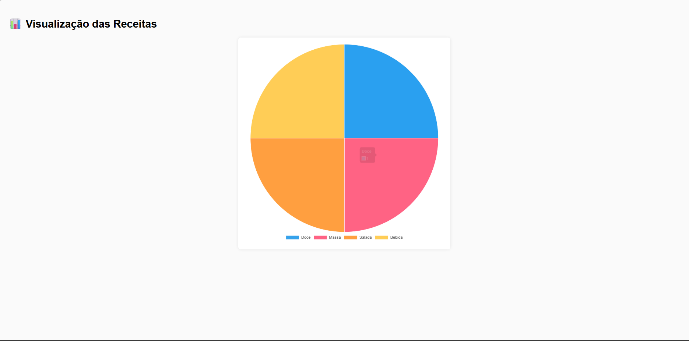
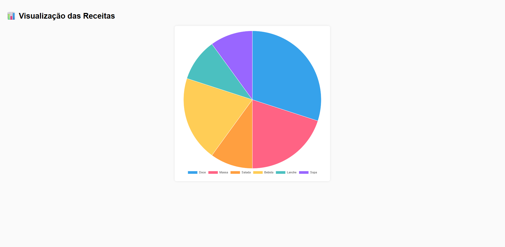

# Trabalho Prático 07 - Semanas 13 e 14

A partir dos dados cadastrados na etapa anterior, esta etapa tem como objetivo desenvolver uma forma dinâmica de apresentar as informações do projeto, representando os dados de maneira clara, visual e interativa.  
Foi utilizado um gráfico gerado com **Chart.js**, consumindo os dados do **JSON Server**, organizando e exibindo categorias das receitas cadastradas pelo usuário.

## Informações do trabalho

- **Nome:** Lucas Silva Borges
- **Matrícula:** 903572  
- **Proposta de projeto escolhida:** Catálogo de Receitas  
- **Breve descrição sobre o projeto:**  
  O projeto tem como objetivo permitir o cadastro, atualização, visualização e exclusão de receitas culinárias.  
  Cada receita possui nome, categoria, descrição, imagem, tempo de preparo, porções e nível de dificuldade.  
  Os dados são armazenados e consumidos através do **JSON Server**, simulando uma API REST.

---

## 📊 Print da tela com a implementação da visualização dinâmica

Nesta etapa foi implementada uma página exclusiva para visualização dos dados:  
**public/visualizacao.html**

A funcionalidade utiliza a biblioteca **Chart.js** para gerar um **gráfico de pizza**, exibindo a quantidade de receitas por categoria (Doce, Massa, Salada, Bebida, Lanche, Sopa etc.).  
O gráfico é atualizado automaticamente de acordo com os dados do `db.json`.

### ✔ Primeira visualização (dados iniciais)


### ✔ Segunda visualização (dados atualizados)


---

## 📁 Estrutura da implementação

- `visualizacao.html` → Página que contém o gráfico  
- `visualizacao.js` → Script que faz a requisição ao JSON Server e monta o gráfico  
- `db/db.json` → Onde as receitas são armazenadas  
- `cadastro_receitas.html` → Tela utilizada para cadastrar e editar receitas  
- `index.html` → Tela inicial do catálogo

---

## ▶️ Como executar

1. Instalar dependências  
   ```bash
   npm install
